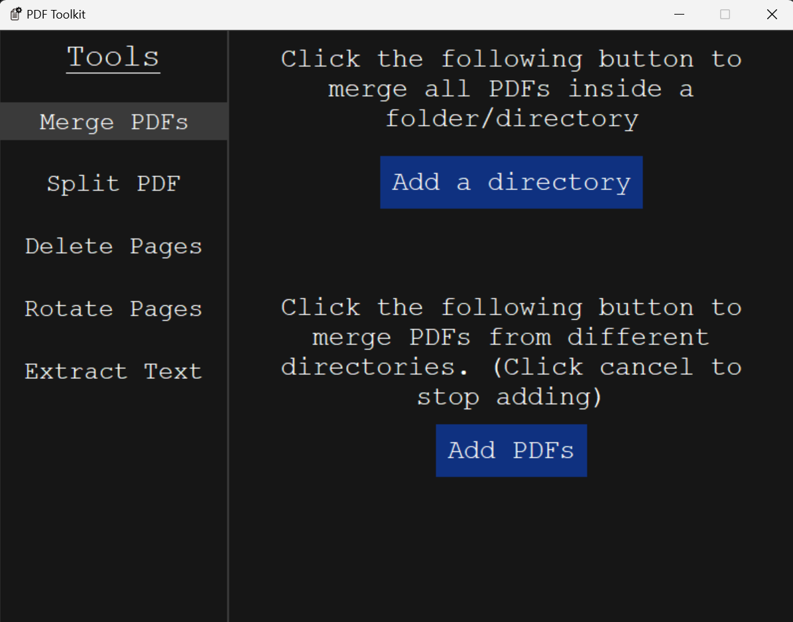

## Installation
Windows users can use the [Releases](https://github.com/karthikeya-aduri/project-pdf/releases/) page for installation.

Linux and MacOS users require Python (latest version) and pip before installing the application. Run the following the command
```python3
pip install pyinstaller
```
Then clone the repository using
```git
git clone https://github.com/karthikeya-aduri/project-pdf
```
Then open terminal inside project-pdf folder/directory and run this command
```python3
pyinstaller --name PDFtools --windowed --onefile --icon=icon.ico main.py
```
Now you will find the app inside dist folder. Place the icon inside dist folder and now you may start using the application.

Note: You can delete build folder, spec file and the python script after installation.

## Features
- Merge PDFs across various folders
- Split a PDF at desired locations
- Delete multiple pages at once
- Rotate multiples pages at once
- Extract text content from PDFs

## Usage
- The PDFs are merged in the order you select them
- The PDFs are split based on user input
- Deletion and Rotation also depend on user input but the order you give them does not matter.

## Screenshots



