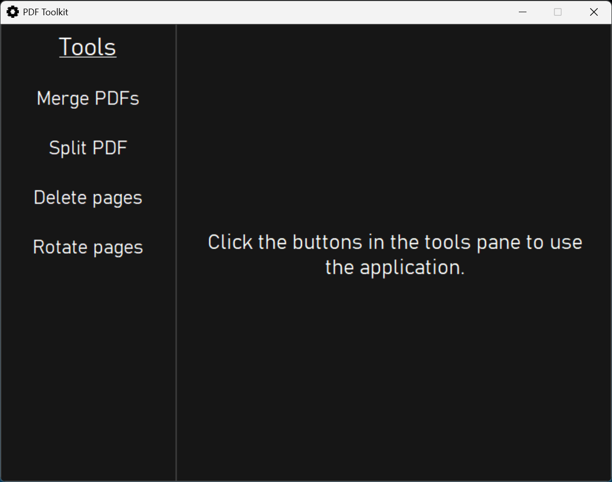
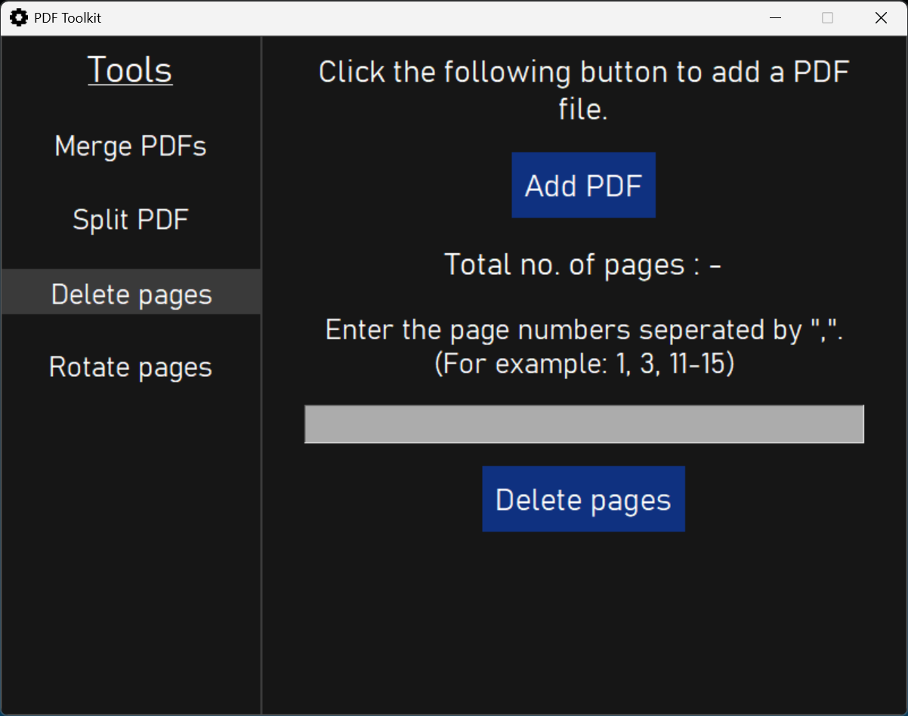

## Installation
Windows and Linux users can use the [Releases](https://github.com/karthikeya-aduri/project-pdf/releases/) page for installation.

MacOS users require Python (latest version) and pip before installing the application. Run the following the command
```python3
pip install pyinstaller
```
Then clone the repository using
```git
git clone https://github.com/karthikeya-aduri/project-pdf
```

## Usage
1. Use without executable file
```python3
python app.py
```

2. Create an executable file
```python3
pyinstaller --name PDFtools --windowed --onefile --icon=icon.png main.py
```
Now you will find the app inside dist folder. Place the icon inside dist folder and now you may start using the application.

Note: You can delete build folder, spec file and the python script after installation.

## Features
- Merge PDFs across various folders
- The PDFs can be reordered before merging
- Split a PDF at desired locations
- Delete multiple pages at once
- Rotate multiples pages at once

## Screenshots






